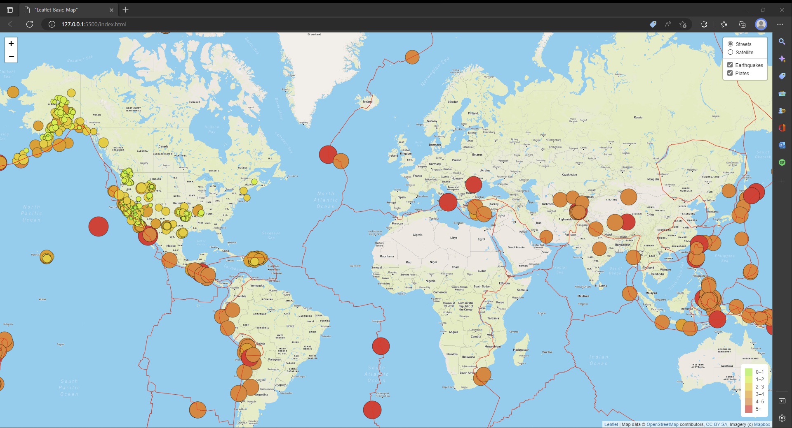
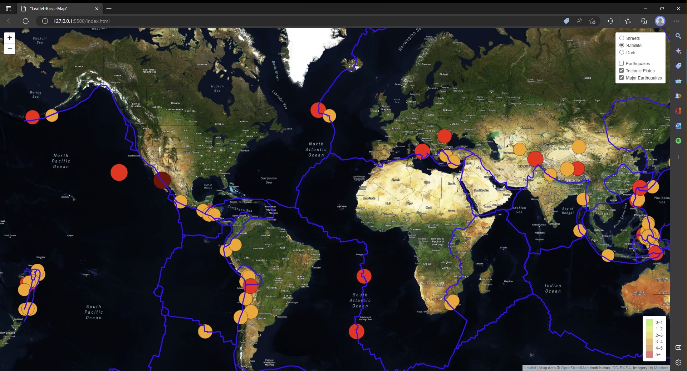
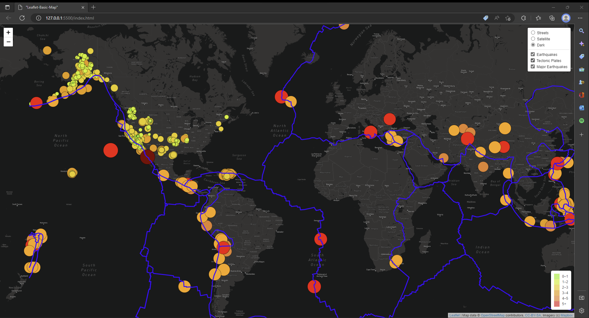

# Mapping_Earthquakes

## Overview

The objective of this module (**Module 13: Mapping Earthquakes with JS & APIs**) is to use _JavaScript_, the _Leaflet_ JS library and _MapBox_ API to create a webpage with an interactive world map displaying earthquake data.

The earthquake data is obtained in GeoJSON format from the _[U.S. Geological Survey site](https://www.usgs.gov/)_.

## Resources

### List of Applications Used

- _HTML5_
- _JavaScript v8_
- _Leaflet 1.9_
- _CSS 3_
- _MapBox API_

### Input Datasets

- **[Earthquake Data](https://earthquake.usgs.gov/earthquakes/feed/v1.0/summary/all_week.geojson)**
- **[Tectonic Plates Boundaries](https://raw.githubusercontent.com/fraxen/tectonicplates/master/GeoJSON/PB2002_boundaries.json)**

### Challenge Starter Code

The following JavaScript starter code is provided to begin the challenge

- **[Tectonic Plate Starter Code](https://2u-data-curriculum-team.s3.amazonaws.com/dataviz-online/module_13/tectonic_plate_starter_logic.js)**
- **[Major Earthquakes Starter Code](https://2u-data-curriculum-team.s3.amazonaws.com/dataviz-online/module_13/major_eq_starter_logic.js)**

## Deliverables

The following is the list of the requested and the provided deliverable files for this modules's challenge.

### Requested Deliverables:

**Deliverable 1:** Add Tectonic Plate Data
**Deliverable 2:** Add Major Earthquake Data
**Deliverable 3:** Add an Additional Map

### Provided Deliverables:

- [HTML Code](./index.html)
- [JavaScript Code](./static/js/challenge_logic.js)
- [CSS Code](./static/css/style.css)\*
- [README File](./README.md)\*
- [Supporting Images](./images/)

## Results

The interactive map can be displayed in a web browser by opening the _index.html_ file

_Image01: Deliverable 1 Map (Including Tectonic Plates)_.

_Image02: Deliverable 2 Map (Including Major Earthquakes)_.

_Image03: Deliverable 3 Map (Including an additional Dark Tile to the Map)_.
